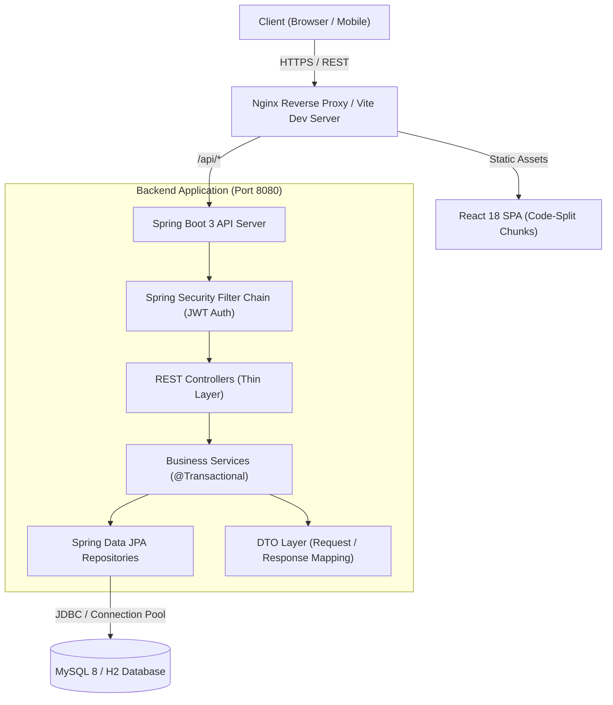
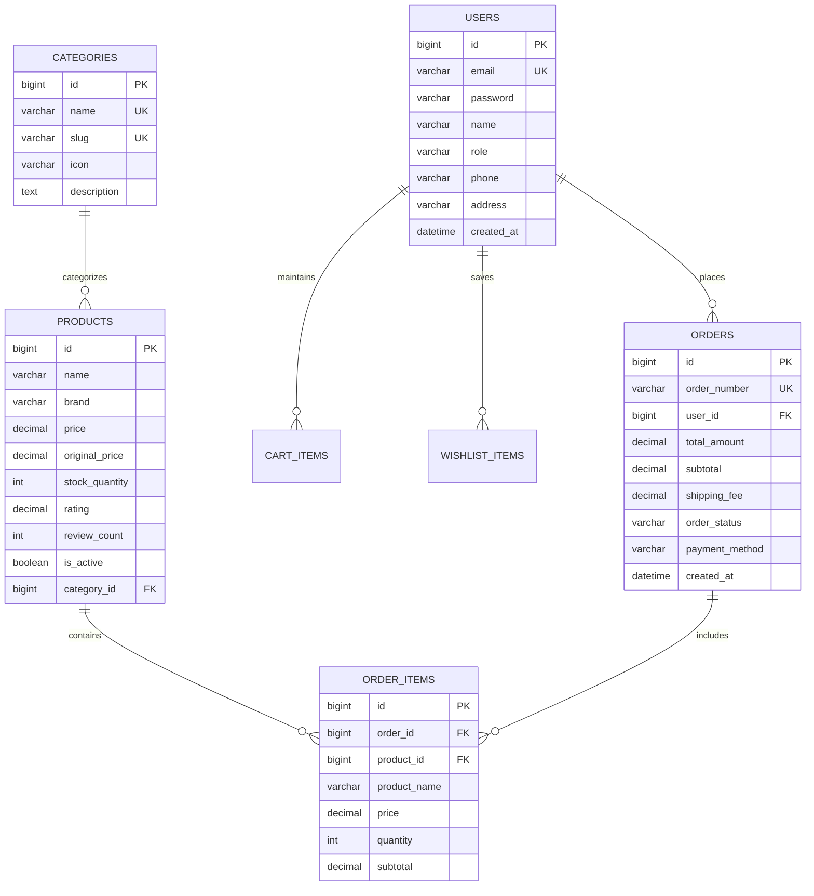

# ShopSphere 🛍️

> **A Production-Grade, Enterprise Full-Stack E-Commerce Platform**  
> Engineered with **Spring Boot 3 (Java 17)**, **React 18 (Vite 5)**, **Tailwind CSS**, and **MySQL / H2**.

---

## 🌟 Executive Summary

**ShopSphere** is a high-performance, secure, and modern commercial e-commerce application designed to deliver an exceptional digital shopping experience for customers and a comprehensive management console for store administrators.

Built with a clean layered architecture, stateless JWT authentication, role-based access control (RBAC), database indexing, code splitting, and automated unit/integration test coverage, ShopSphere reflects commercial software engineering best practices from database schema design to responsive UI micro-interactions.

---

## 📑 Table of Contents

- [Features](#-features)
- [Technology Stack](#-technology-stack)
- [System Architecture](#-system-architecture)
- [Database Architecture & Indexing](#-database-architecture--indexing)
- [API Reference](#-api-reference)
- [Authentication & Security Model](#-authentication--security-model)
- [User Experience & Visual Showcase](#-user-experience--visual-showcase)
- [Local Development Setup](#-local-development-setup)
- [Docker Deployment](#-docker-deployment)
- [Environment Variables](#-environment-variables)
- [Automated Testing Suite](#-automated-testing-suite)
- [Future Roadmap](#-future-roadmap)

---

## ✨ Features

### 🛒 Customer Storefront & Shopping Journey
- **Dynamic Catalog Browsing**: Search across products, brands, and categories with real-time 300ms debouncing.
- **Multi-Faceted Filtering**: Filter by category, price ranges (presets or custom bounds), minimum customer ratings, and in-stock availability.
- **Multi-Criteria Sorting**: Sort by featured, price (ascending/descending), rating, and recency.
- **Product Details & Gallery**: High-resolution image galleries with graceful SVG fallbacks, stock status badges, dynamic discount calculations, technical specifications, and verified customer reviews.
- **Persistent Wishlist**: One-tap wishlist toggle with animated feedback and optimistic state synchronization.
- **Dynamic Cart & Stock Guard**: Real-time quantity adjustments, coupon validation (`SAVE10`), free shipping progress bar, and authoritative server-side stock constraints.
- **Multi-Step Checkout**: 3-step checkout flow (Shipping Address & Contact Info → Order Review → Cash on Delivery confirmation).
- **Real-Time Order Tracking**: Responsive, interactive order timeline showing discrete order states (`PLACED`, `CONFIRMED`, `PROCESSING`, `SHIPPED`, `DELIVERED`, `CANCELLED`).

### 📊 Enterprise Administrative Suite
- **Analytics Dashboard**: Real-time KPI cards (Gross Revenue, Total Orders, Customer Count, Active Products, Low Stock Alerts) and visual order status distribution charts.
- **Product Catalog Management**: Full CRUD operations for products, rich descriptions, pricing, discounts, category association, and quick stock/price inline updates.
- **Category Management**: Category hierarchy with custom slug generation and iconography.
- **Real-Time Inventory Console**: Visual stock level bars, low stock warnings, batch filtering, and instant single-click stock replenishment.
- **Order Management & Fulfillment**: Complete lifecycle management with state machine validation (`PLACED` → `CONFIRMED` → `PROCESSING` → `SHIPPED` → `DELIVERED`). Automatic stock restoration upon order cancellation.
- **Customer Directory**: Customer profiles, spending metrics, order history, and account activation/deactivation controls.

---

## 🛠️ Technology Stack

| Layer | Technologies |
| :--- | :--- |
| **Frontend** | React 18, Vite 5, Tailwind CSS, Lucide Icons, React Router 6, Axios |
| **Frontend Testing** | Vitest 1.6, React Testing Library, JSDOM, User Event |
| **Backend** | Java 17, Spring Boot 3.2.5, Spring Security 6, Spring Data JPA, Hibernate 6 |
| **Backend Testing** | JUnit 5, Mockito, AssertJ, Spring Boot Test, H2 In-Memory DB |
| **Database** | MySQL 8.0 (Production), H2 Database (Development & Unit Tests) |
| **DevOps & Tooling** | Docker, Docker Compose, Multi-Stage Builds, Nginx, Maven |

---

## 🏗️ System Architecture

ShopSphere adheres to an enterprise layered architecture ensuring strict separation of concerns, transactional integrity, and maintainability.



### Architectural Principles:
1. **Thin Controllers**: Controllers only handle HTTP status mapping, request validation (`@Valid`), and delegation to services.
2. **Encapsulated Business Logic**: Authoritative pricing, stock deductions, and status transition workflows reside strictly within `@Service` classes.
3. **No Direct Entity Exposure**: Entities never leak across the REST layer; clean DTOs protect internal schemas and eliminate circular reference hazards.
4. **Authoritative Server Pricing**: Client cannot manipulate order prices or totals; all pricing is verified from the database at order placement time.

---

## 🗄️ Database Architecture & Indexing

### Entity Relationship Model



### Strategic Database Indexes
To ensure sub-millisecond query performance under load, critical access paths are indexed:
- `products`: `(is_active)`, `(is_active, category_id)`, `(price)`, `(rating)`
- `orders`: `(user_id, created_at)` composite index for instant customer order history retrieval, and `(created_at)` for analytics ranges.
- `users`: `(role)` for admin customer filtering.

---

## 📡 API Reference

### Public Endpoints
| Method | Endpoint | Description |
| :--- | :--- | :--- |
| `POST` | `/api/auth/register` | Register new customer account |
| `POST` | `/api/auth/login` | Authenticate and retrieve JWT token |
| `GET` | `/api/products` | Paginated product search, filter, and sort |
| `GET` | `/api/products/{id}` | Detailed product specifications by ID |
| `GET` | `/api/categories` | List active product categories |
| `GET` | `/api/health` | Application health and status probe |

### Customer Protected Endpoints (`ROLE_CUSTOMER`, `ROLE_ADMIN`)
| Method | Endpoint | Description |
| :--- | :--- | :--- |
| `GET` | `/api/cart` | Retrieve current user shopping cart |
| `POST` | `/api/cart/items` | Add product to cart with quantity validation |
| `PATCH`| `/api/cart/items/{id}` | Update quantity of cart item |
| `DELETE`| `/api/cart/items/{id}` | Remove product from cart |
| `DELETE`| `/api/cart` | Clear entire shopping cart |
| `GET` | `/api/wishlist` | Retrieve customer wishlist |
| `POST` | `/api/wishlist/toggle` | Toggle product in customer wishlist |
| `POST` | `/api/orders` | Create verified order from shopping cart |
| `GET` | `/api/orders/my-orders` | Paginated list of customer orders |
| `GET` | `/api/orders/{id}` | Detailed order metadata (IDOR protected) |
| `GET` | `/api/orders/{id}/tracking`| Real-time order progress timeline |
| `GET` | `/api/users/profile` | Retrieve authenticated user profile |
| `PUT` | `/api/users/profile` | Update profile information |

### Administrator Protected Endpoints (`ROLE_ADMIN`)
| Method | Endpoint | Description |
| :--- | :--- | :--- |
| `GET` | `/api/admin/dashboard` | Aggregated revenue and order distribution metrics |
| `POST` | `/api/products` | Create new catalog product |
| `PUT` | `/api/products/{id}` | Update existing product details |
| `DELETE`| `/api/products/{id}` | Soft delete product |
| `PATCH`| `/api/products/{id}/stock` | Update stock quantity |
| `PATCH`| `/api/products/{id}/price` | Update price and discount |
| `GET` | `/api/admin/orders` | Query all platform orders with status filters |
| `PATCH`| `/api/admin/orders/{id}/status` | Transition order status |
| `GET` | `/api/admin/inventory` | Inventory table with low stock indicators |
| `GET` | `/api/admin/inventory/stats` | Consolidated inventory statistics |
| `POST` | `/api/categories` | Create new category |

---

## 🔒 Authentication & Security Model

ShopSphere implements defense-in-depth security principles:

1. **Stateless JWT Tokens**: Signed using HMAC-SHA256 with externalized secrets and 24-hour expiration.
2. **BCrypt Password Hashing**: Passwords stored using adaptive BCrypt hashing with standard work factor. Passwords are never returned in responses.
3. **Role-Based Access Control (RBAC)**: Enforced at both HTTP security filter level and method level with Spring Security expressions.
4. **IDOR Prevention**: Customer order and profile endpoints enforce ownership validation. A customer cannot view or modify another customer's orders.
5. **Authoritative Price & Stock Integrity**: Client cannot pass authoritative unit prices; server queries the database price and rejects orders exceeding available stock.
6. **Input Sanitization & Validation**: Jakarta Bean Validation (`@NotBlank`, `@Email`, `@Min`, `@Size`) prevents malformed data and injection attacks.
7. **Production Secrets Isolation**: Database credentials, JWT secrets, and admin seed passwords are fully externalized via environment variables.

---

## 📸 User Experience & Visual Showcase

| View | Description |
| :--- | :--- |
| **Storefront Home** | High-impact hero section, curated categories, trending deals, and responsive product cards with hover actions. |
| **Catalog & Filters** | Sticky desktop filter panel, mobile drawer filter, search debounce, and list/grid layout toggles. |
| **Product Details** | Interactive thumbnail gallery, specs table, verified customer reviews, and sticky mobile action bar. |
| **Cart & Checkout** | Clear cart summary, discount voucher application, free shipping progress bar, and 3-step checkout. |
| **Order Tracking** | Horizontal visual stepper for desktop and vertical timeline for mobile with real-time status cues. |
| **Admin Dashboard** | Executive KPI metric cards, interactive order distribution charts, and quick-action shortcuts. |
| **Inventory Console** | Progress-bar stock meters, low-stock alerts, and inline stock replenishment. |

---

## 🚀 Local Development Setup

### Prerequisites
- **Java**: OpenJDK 17 or higher
- **Node.js**: v18.0.0 or higher
- **Maven**: 3.8+ (or use packaged scripts)

### 1. Clone the Repository
```bash
git clone https://github.com/your-username/shopsphere.git
cd shopsphere
```

### 2. Configure Environment
```bash
cp .env.example .env
cp frontend/.env.example frontend/.env
```

### 3. Run the Backend (Spring Boot)
The `dev` profile uses an in-memory MySQL-mode H2 database with pre-seeded products and admin accounts.
```bash
cd backend
mvn clean spring-boot:run
```
Backend will start on: **`http://localhost:8080`**

### 4. Run the Frontend (React + Vite)
In a separate terminal:
```bash
cd frontend
npm install
npm run dev
```
Frontend will start on: **`http://localhost:5173`**

### Default Accounts for Testing:
- **Admin**: `admin@shopsphere.com` / `Admin@123456`
- **Customer**: `customer@shopsphere.com` / `Customer@123456`

---

## 🐳 Docker Deployment

To launch the complete production stack (MySQL 8, Spring Boot Backend, and Nginx-backed React Frontend) in one command:

```bash
docker compose up --build -d
```

### Containers:
- **Frontend SPA**: `http://localhost:80`
- **Backend REST API**: `http://localhost:8080/api`
- **MySQL Database**: `localhost:3306`

To shut down:
```bash
docker compose down -v
```

---

## 🧪 Automated Testing Suite

ShopSphere features a robust, automated test suite covering unit, integration, and security scenarios.

### Backend Test Suite (JUnit 5 + Mockito)
Runs 135 automated tests testing authentication, stock validation, cart computations, order lifecycle, and IDOR protection:
```bash
cd backend
mvn test
```
*Result: `Tests run: 135, Failures: 0, Errors: 0, Skipped: 0` (`BUILD SUCCESS`)*

### Frontend Test Suite (Vitest + RTL)
Tests core component interactions, buttons, form validations, and product card accessibility:
```bash
cd frontend
npm test
```
*Result: `Test Files: 3 passed, Tests: 12 passed`*

---

## 🗺️ Future Roadmap

- [ ] **Payment Gateway Integration**: Razorpay / Stripe webhook processing.
- [ ] **Redis Distributed Caching**: Session caching and catalog cache invalidation.
- [ ] **Full-Text Search Engine**: Elasticsearch / OpenSearch integration.
- [ ] **Real-Time Push Notifications**: WebSocket or SSE for order fulfillment updates.
- [ ] **Multi-Currency & Internationalization**: Currency switching with dynamic FX rates.

---

## 📄 License

This project is licensed under the MIT License — see the [LICENSE](LICENSE) file for details.
